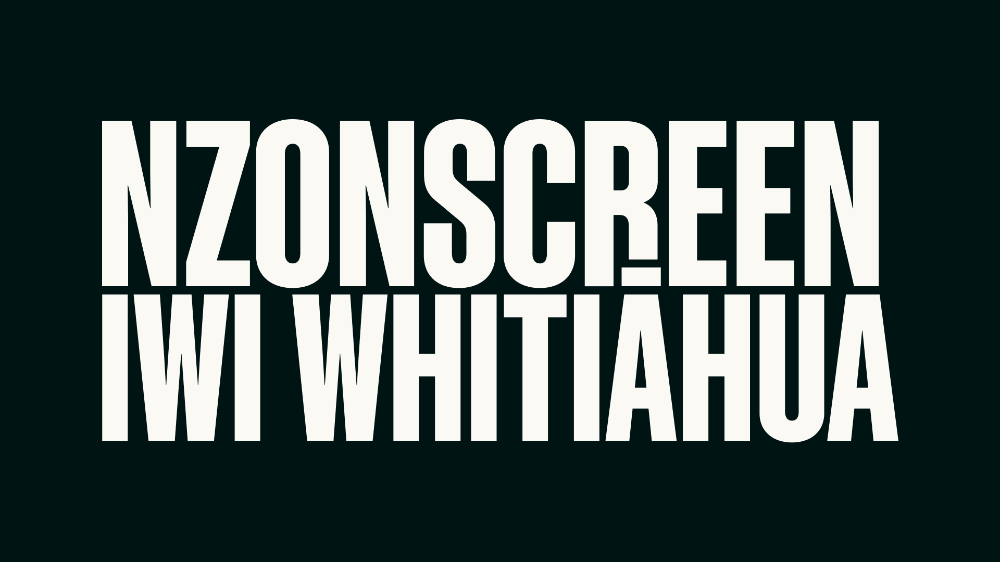

# NZ On Screen for Kodi

[](https://kodi.tv/)
[](https://www.python.org/)
[](https://github.com/kiaoragithub/kodi-nzonscreen-addon/actions/workflows/validate.yml)
[](https://github.com/kiaoragithub/kodi-nzonscreen-addon)



An unofficial Kodi video add-on for browsing and playing the public catalogue at
[NZ On Screen](https://www.nzonscreen.com/). It is designed for Kodi 21 Omega and Python 3.

## Features

- Browse television, film, series, music videos, collections, interviews, profiles and NZOS+
- Search by live NZ On Screen categories, genres and decades
- Open first-level and deeper nested website pages
- Play single videos and correctly ordered multi-part programmes
- Display the exact trailer, excerpt, part or credits label during playback
- Show available metadata, artwork and genuine subtitle/caption tracks
- Retrieve short-lived playback tokens only when playback starts
- Use encrypted MPEG-DASH/Widevine through Kodi InputStream Adaptive

## Recommended installation — automatic updates

1. Download [`repository.nzonscreen-1.0.1.zip`](https://kiaoragithub.github.io/kodi-nzonscreen-addon/repository.nzonscreen-1.0.1.zip).
2. In Kodi, open **Settings → System → Add-ons** and enable **Unknown sources** if needed.
3. Open **Settings → Add-ons → Install from zip file** and select the downloaded repository ZIP.
4. Choose **Install from repository → NZ On Screen Add-on Repository → Video add-ons → NZ On Screen → Install**.

Installing through the repository allows Kodi to receive future add-on updates automatically.

## Direct installation

Download [`NZ-On-Screen-Kodi-1.0.5.zip`](https://github.com/kiaoragithub/kodi-nzonscreen-addon/raw/main/NZ-On-Screen-Kodi-1.0.5.zip),
then select **Settings → Add-ons → Install from zip file** in Kodi. Direct installation works,
but installing the repository first is recommended for automatic updates.

Kodi may ask to install or enable InputStream Adaptive and the Widevine CDM when a protected
video is played for the first time.

## Playback behaviour

- A page containing one playable video starts it directly.
- A page containing multiple clips offers **Play all parts** or a choice of individual clips.
- **Play all parts** plays every clip consecutively in one Kodi playlist.
- Numbered programme parts are shown in their natural order, with credits last.
- Rental, account, rights and geographic restrictions continue to be enforced by NZ On Screen.

## Troubleshooting

If a title does not play:

1. Confirm the installed add-on version under **Add-ons → My add-ons → Video add-ons → NZ On Screen**.
2. Check that InputStream Adaptive is installed and enabled.
3. Restart Kodi after a Widevine installation or update.
4. Try another public title to distinguish an add-on problem from a title-specific restriction.
5. [Open a bug report](https://github.com/kiaoragithub/kodi-nzonscreen-addon/issues/new?template=bug_report.yml) with the exact title, page URL, Kodi version and relevant Kodi log lines.

Do not publish complete Kodi logs without checking them for personal information.

## Development

Run the parser regression tests with:

```bash
python -m unittest discover -s tests -v
```

Every change to the parser or repository metadata is automatically checked by GitHub Actions.
See [CONTRIBUTING.md](CONTRIBUTING.md) for contribution guidance and [CHANGELOG.md](CHANGELOG.md)
for release history.

## Legal and availability

This is an unofficial community project and is not affiliated with or endorsed by NZ On Screen.
Content, availability, rental access, accounts, regional restrictions, DRM and rights are controlled
by NZ On Screen and its providers. The add-on does not bypass login, payment, DRM or geographic restrictions.

Licensed under GPL-3.0-or-later. See [LICENSE.txt](LICENSE.txt).

Keywords: Kodi add-on, Kodi video add-on, New Zealand television, New Zealand film, NZ On Screen,
Aotearoa screen history, Python Kodi plugin.
